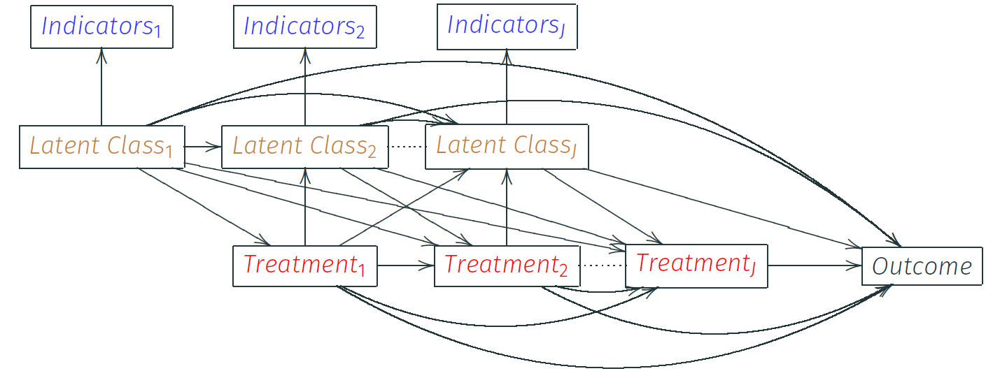
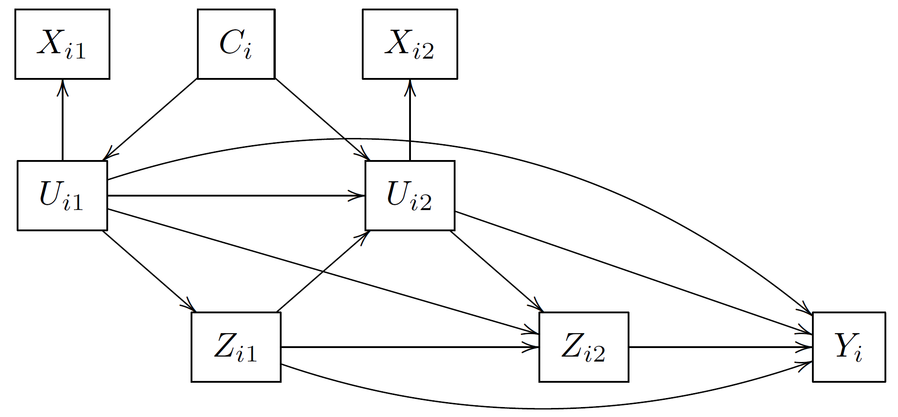
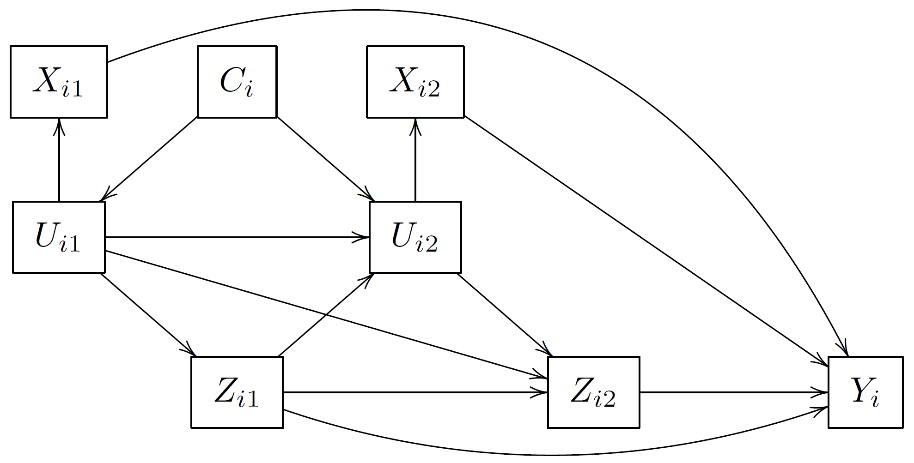
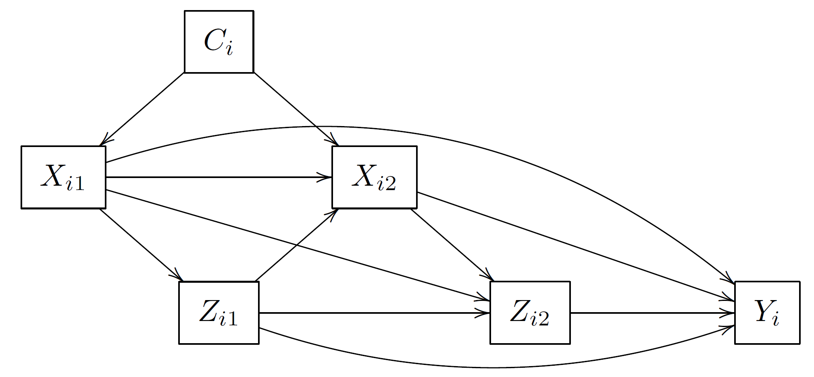
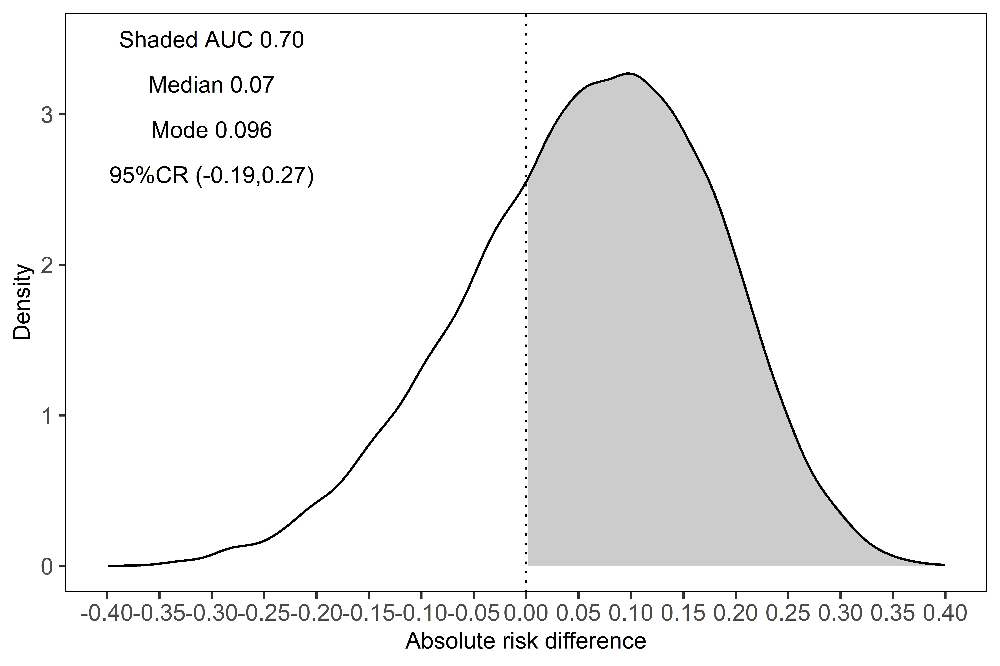

class: left, left

## Background 
***
-  Causal inference from longitudinal data with limited sample size and a large number of time-dependent covariates is challenging

<!--   -  convergence -->
<!--   -  over-fitting -->
<!--   -  sensitive to sample and model changes -->
  
--

-  Existing Bayesian causal methods such as Bayesian MSM and Bayesian PSA are not full Bayesian

-  Parametric Bayesian g-computation
    -  requires specification of covariates distribution
    -  can be computationally intractable
  
--

-  We proposed a Bayesian latent class approach that
    -  features **dimension reduction of covariates**
    -  a **full** Bayesian approach
  
---

##  Longtiduinal DAG
***


> -  The indicators (previous measured covariates) are considered as manifestations from the time-dependent latent classes
-  The latent classes, not the indictors, directly affect treatment assignment and outcome

---

## Proposed Bayesian Latent Class Approach
***
-  The likelihood of the observed data

\begin{align}
   & \prod_{i=1}^n \sum_{U_{ik}}^M \ldots\sum_{U_{i1}=1}^M P(Y_i | \bar{Z}_i, \bar{U}_{i} = \bar{u}_{k}, \theta) \prod_{j=1}^{k}  \Big[ P(Z_{ij} | \bar{Z}_{ij-1}, \bar{U}_{ij} = \bar{u}_{j}, \gamma_j ) \nonumber \\
    & \times   P(U_{ij}=u_j | \bar{U}_{ij-1}=\bar{u}_{j-1},\bar{Z}_{ij-1}, \alpha_j )P(X_{ij} | U_{ij}=u_j, \beta_j) \Big] \nonumber
\end{align}

  -  $n$ subjects, $k$ visits and $M$ number of latent classes
  -  $\alpha$, $\beta$, $\gamma$ and $\theta$ are model parameters
  -  $P(X_{ij} | U_{ij}=u_j, \beta_j) = \prod_{l=1}^{p} P( X_{ijl} | U_{ij} , \beta_{jl})$, .red[indicator model]


- Estimate $E[Y_i^{ \bar{a}}]$ using <span style="color: red;">Bayesian posterior predictive inference</span>


---

class: ut-pantone_lime

# Simulation Study
.font110[
1. Simulation data feature latent classes

2. Simulation data do not feature latent classes (misspecification)
]

---

## Simulated DAGs
***
.pull-left[

<br/><br/>
<br/><br/>


.font85[DAG1 with latent confounder class]
]
.pull-right[

.font85[DAG2 without latent confounder class for the outcome model]


.font85[DAG3 without latent confounder class for the outcome and treatment model]
]

---

## Simulation Results (DAG1)
***
Simulation results for $E[Y^{(1,1)}] − E[Y^{(0,0)}]$ over 1000 replications with 500 samples and misspecified outcome model

```{r echo=F, include=T, tidy=TRUE, warning=FALSE}
library(kableExtra)
options(knitr.kable.NA = '')

simtab1<-read.csv("assets/simtab1.csv", header = T)
colnames(simtab1)[1]<-"Indicators (H, M, L)"

kbl(simtab1) %>%
  kable_paper("striped", full_width = F) %>%
  row_spec(c(2,3,6,7), bold=T,color = "black", background = "#DAF7A6") %>%
  row_spec(c(4,8), color = "red", background="white") %>%
  row_spec(c(9),  background="#FFFD33") %>%
  kable_classic(full_width = T,position = "center")%>%
  scroll_box(height = "300px")

```

.font85[
- **High quality** (H): binary indicator with a probability of 0.9 in a given class
- **Medium quality** (M): binary indicator with a probability of 0.75 in a given class
- **Low quality** (L): binary indicator with a probability of 0.6 in a given class]

---

## Simulation Results (DAG2)
***
Simulation results for $E[Y^{(1,1)}] − E[Y^{(0,0)}]$ over 1000 replications with 500 samples and medium level latent class confounding.

```{r echo=F, include=T, tidy=TRUE}
options(knitr.kable.NA = '')

simtab2<-read.csv("assets/simtab2.csv", header = T)
colnames(simtab2)[1]<-"Indicators (H, M, L)"

kbl(simtab2) %>%
  kable_paper("striped", full_width = F) %>%
  row_spec(c(2,6), bold=T,color = "black", background = "#DAF7A6") %>%
  row_spec(c(4,8), color = "red", background = "white" ) %>%
  kable_classic(full_width = T,position = "center")%>%
  scroll_box(height = "300px")

```

-  Good performance under misspecified outcome model

---

## Quick Summary
***

-  Bayesian latent class approach performs well when
    1.  data contain at least one _**high quality indicator**_
    2.  true causal structure features _**latent classes**_


-  Bayesian latent class approach can still perform well under
misspecification

-  In our simulation, we assume the number of latent classes are known


---

## Application - The Sickkids JDM Study
***
-  <span style="color: orange;">Study objective</span>: investigating the efficacy of IVIg in treating new onset JDM

-  <span style="color: orange;">Study outcome</span>: Achieving a zero Child Health Assessment
Questionnaire (CHAQ) score at 18-month (0= Daily living
without any difficulty, 3= Unable to perform daily activity)

-  <span style="color: orange;">Treatment</span>: exposure to IVIg within 6 months of each
follow-up visits

- <span style="color: orange;">Clinical indicators</span>
  1.  present functional status (normal versus abnormal)
  2.  currently taking prednisone (yes versus no)
  3.  presence of Gottron’s papules
  4.  presence of heliotrope rash
  5.  presence of abnormal nailfold capillaries


---
## JDM Analysis
***
- Average potential outcomes
  1.  <span style="color: red;">"Always treated"</span>: Probability of achieving normal daily activity at 18-month among patients who were exposed to IVIG and remained on IVIG prior to the 18-month follow-up visit
  2.  <span style="color: red;">"Never treated"</span>: Probability of achieving normal daily activity at 18-month among patients who were IVIG free within 18 months

-  We used WAIC to determine the number of latent confounder classes

-  Vague uniform priors

---

## JDM Results
***
.left-column[

<br/>

A 70% chance of observing a higher probability of achieving normal daily activity under ’always treated’.
<span style="color: orange;">(evidence of efficacy)</span>

]

.right-column[

<span style="color: white;">skip</span> Figure 1: Posterior predictive distribution of the <span style="color: white;">skip</span> estimated risk difference on study outcome
]

---

# Future Direction
***
 - Bayesian latent class methods for causal inference
  -  unknown number of latent classes
  -  more generalized causal mechanisms
  -  frame with a continuous latent variable


## Closing thoughts `r emo::ji("cheers")`
    
- why Bayesian?
    - Bayesian causal inference is useful in clinical research
      - choice of prior
      - probability summary
      - "hidden" advantage: missing data, variable selection etc.
- Make it robust?
    - non-parametric Bayesian
---

# Acknowledgements
***
.pull-left[
- Supervisory committee
    - Eleanor Pullenayegum
    - Olli Saarela
    - George Tomlinson
    
- JDM Sickkids research team
    - Brian Feldman
    - Ingrid Goh

-  PhD research is supported by the Canadian Institutes of Health Research, Doctoral Research Award GSD-152386
]

.pull-right[


]

<!-- --- -->
<!-- ## Testing - yes I can make tikz! -->

<!-- ```{tikz, tikz-ex, fig.cap = "Funky tikz", fig.ext = 'png', cache=TRUE, echo=FALSE} -->
<!-- \usetikzlibrary{arrows} -->
<!-- \begin{tikzpicture}[node distance=2cm, auto,>=latex', thick, scale = 0.5] -->
<!-- \node (P) {$P$}; -->
<!-- \node (B) [right of=P] {$B$}; -->
<!-- \node (A) [below of=P] {$A$}; -->
<!-- \node (C) [below of=B] {$C$}; -->
<!-- \node (P1) [node distance=1.4cm, left of=P, above of=P] {$\hat{P}$}; -->
<!-- \draw[->] (P) to node {$f$} (B); -->
<!-- \draw[->] (P) to node [swap] {$g$} (A); -->
<!-- \draw[->] (A) to node [swap] {$f$} (C); -->
<!-- \draw[->] (B) to node {$g$} (C); -->
<!-- \draw[->, bend right] (P1) to node [swap] {$\hat{g}$} (A); -->
<!-- \draw[->, bend left] (P1) to node {$\hat{f}$} (B); -->
<!-- \draw[->, dashed] (P1) to node {$k$} (P); -->
<!-- \end{tikzpicture} -->
<!-- ``` -->


