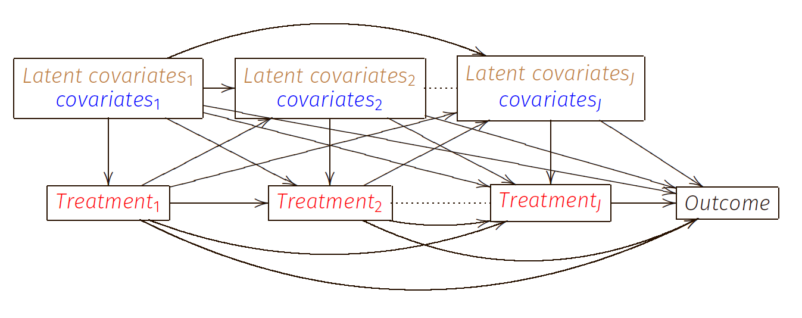

class: left, left

```{r style-share-again, echo=FALSE}
xaringanExtra::style_share_again(
  share_buttons = c("twitter", "linkedin")
)
```

---
class: center, middle
## `r emo::ji("star")` About me `r emo::ji("star")`
***
I am an Assistant Professor in .blue[Health Services Research (outcomes and evaluation method emphasis)] at IHPME. 

--

I also hold a cross-appointment at the .blue[Division of Biostatistics].

--

I am a DLSPH alumna `r emo::ji("heart")`

--

My areas of methodological interest include .red[causal inference], .blue[Bayesian statistics], .green[longitudinal data analysis], .orange[bias analysis], and .black[semi-parametric/parametric joint modelling].

--

My current research focuses on .bold[.orange[applied Bayesian statistics]] and .bold[.orange[causal inference with longitudinal data]].


--

Besides academic work and creating fun data visualizations in R `r emo::ji("smile")`. I love watercolour painting `r emo::ji("paint")`, taking contemporary dance classes in TOronto `r emo::ji("dancing")`, and playing 'piano' `r emo::ji("piano")`.

---

class: ut-pantone_yellow

# **on Bayesian Causal Inference with Longitudinal Data**

---

##  Background
***

- .bold[.blue[Longitudinal observational studies]] enable timely assessment of exposure effects and are invaluable when randomized experiments are deemed infeasible.


- .blue[Longitudinal statistical causal inference methods] are required to gather evidence such design and data


--

- Many of the existing causal inference frameworks and methods for time-varying exposures were developed under the .bold[.orange[frequentist domain]]. 

- Bayesian causal methods to handle longitudinal data have received little attention in the statistical literature `r emo::ji("shrug")`

---

## Are you Bayesian yet?

.bold[.blue[Bayesian causal inference methods]] can be .bold[.blue[preferable]], they allow

- `r emo::ji("check")` propagation of estimation uncertainty,

- `r emo::ji("check")` provide decision-theoretic probabilistic summaries, 
    - [many issues with P-value](https://www.tandfonline.com/doi/full/10.1080/00031305.2016.1154108)
    - interpretable posterior (predictive) probability summary
    
    > P(extreme data | null effect) vs P(causal effect | data)
    
   <!-- $$P(\text{extreme data} \mid \text{null effect}) \text{ vs } P( \text{causal effect} \mid data)$$ -->

- `r emo::ji("check")` easily incorporate informative priors to use past evidence and external information.

---

## Past Work
***

.bold[.blue[Repeatedly measured outcome ]]

- I extended .red[Bayesian propensity score analysis] and .red[Bayesian marginal structural models] to estimate a time-varying exposure with a repeatedly measured outcome. (Liu et al, 2020)

- Prior to this work, no existing Bayesian causal methods could handle a repeatedly measured outcome.

--

.bold[.blue[Latent confounding classes]]

- I developed an innovative .red[Bayesian latent class approach] to causal estimation with longitudinal data.  (Liu et al, 2022)

- This approach simplifies the specification of the time-dependent confounding distribution, and can overcome unmeasured confounding. 


---

##  Future Directions
***

.bold[.blue[Bayesian causal estimation with latent confounding]]



- Develop a Bayesian sensitivity analysis for longitudinal data
- Extensions to the Bayesian latent class approach 

---

##  Future Directions
***
.bold[.blue[Bayesian causal modelling with variable selection]]

- develop extensions to Bayesian variable selection techniques (Bayesian LASSO and spike-and-slab priors)

.bold[.blue[Bayesian causal modelling with multiple outcomes]]

- propose a Bayesian causal joint model of **longitudinal and survival outcomes** with shared parameters to quantify the correlation between outcomes


> The **long-term goal** of my research program is .red[to improve] the use of Bayesian causal methods in the design and analysis of observational studies.

---

# Collaborators `r emo::ji("cheers")`
***
.pull-left[
- Eleanor Pullenayegum
- Olli Saarela
- George Tomlinson
- Brian Feldman 
- Linda Hiraki
- Deborah Levy
- Amanda Ricciuto
- Suzanne Cadarette 
- Geoff Anderson
- Aya Mitani
- Hailey Banack
- and more!

]

.pull-right[


]

